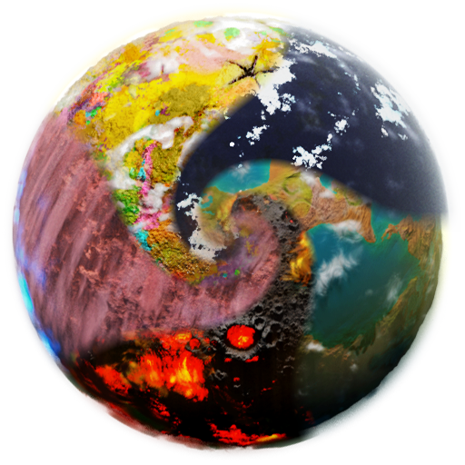
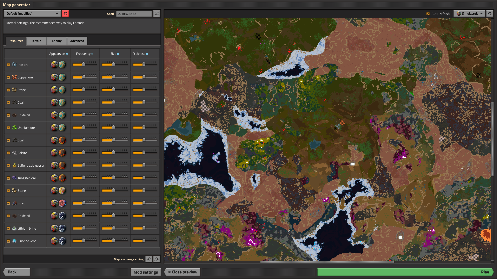
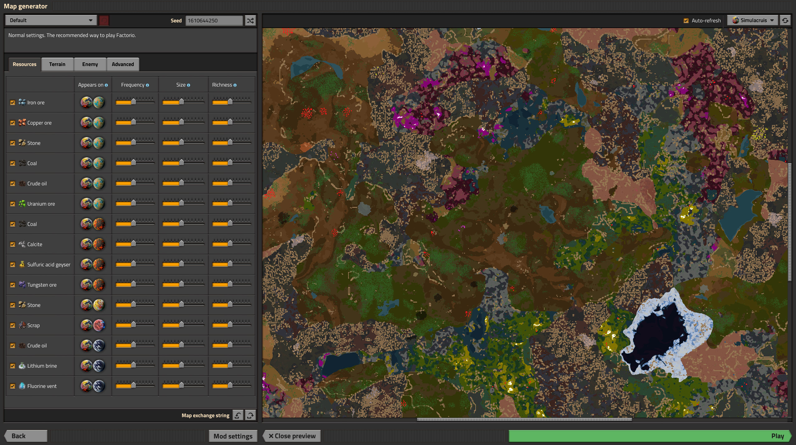
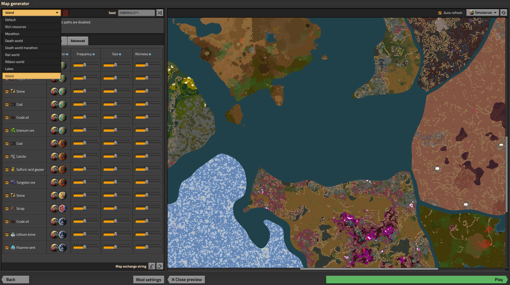
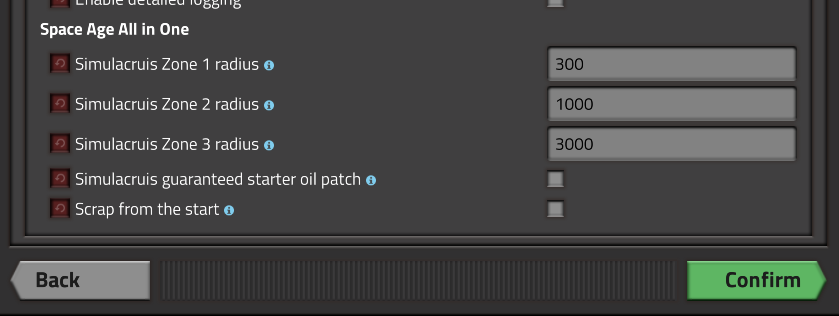
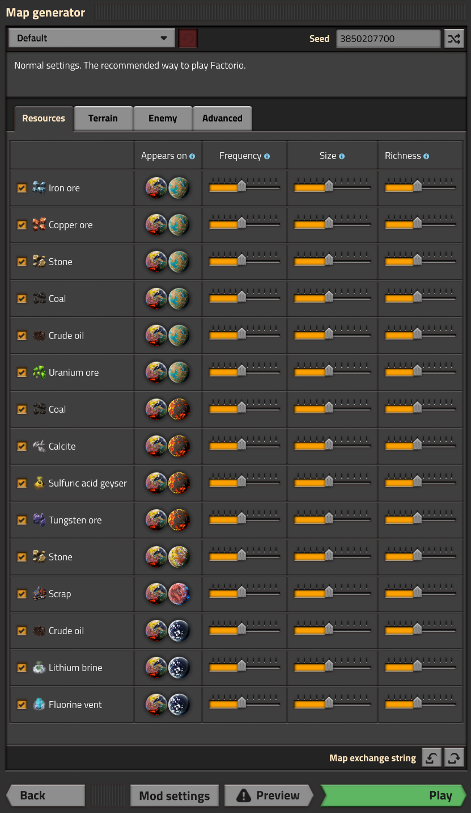
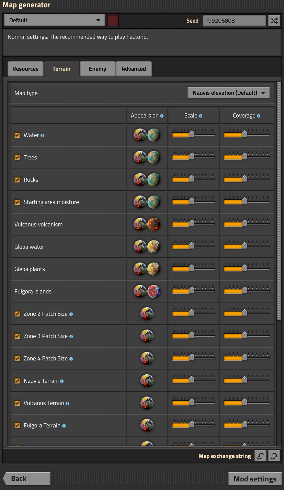
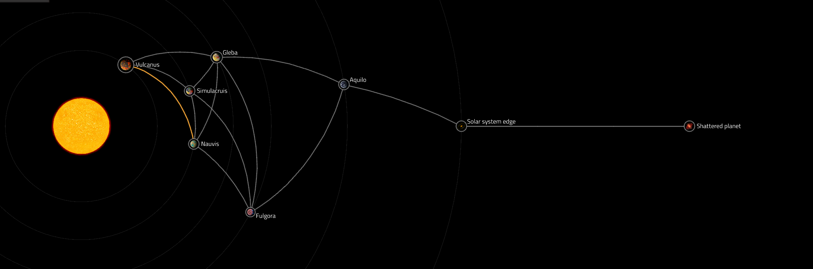
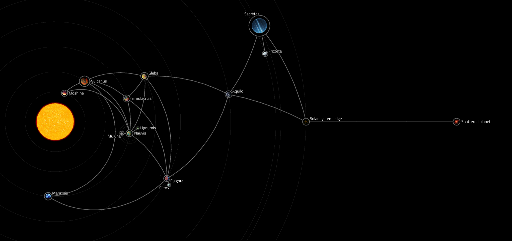

# Space Age All in One - Simulacruis

## Overview

Simulacruis is a planet that combines all the Space Age planets: Nauvis, Vulcanus, Fulgora, Gleba and Aquilo. You shall see all planets' biomes, resources and enemies here.

### This mod is for you if you like Space Age and

- You would like a twist for your early game experience but still keeping it Space Age-ish.
- You would like to take a break from inter-planet logistics.
- You would like to start a new game with an expedited experience so that you can explore other modded planets quicker.

## Major features

- Start at a planet with all Space Age planets' environment.
- Customization on the map generation of the planet.
- **NEW!!** You may select island mode in map generation. Each island will be their own biome. (Althoug, some may have overlap due to map generation)
- Modified research tree to access non-Nauvis resources earlier.
- Crafting and building restrictions are completely removed, except space platform only ones.
- Added a ground recipe for promethium science pack.
- Space and access to the original planets are left intact.

## Balancing (sort of)

Having more options earlier on is the core concept of this mod and I expect the gameplay should somehow be easier. However, I would also like to make it such that the gameplay won't be trivial. This brings the concept of zones in map generation. From center to outer, the map consists of Zone 1 to Zone 4.

### Zone 1

Nauvis only starting zone with starter ore patches and water.

### Zone 2

Introducing Vulcanus, Fulgora and Gleba. The idea is based on the early inner planet stage.

#### Vulcanus

- Brings calcite and sulfuric acid patches.
- Small amount of tungsten from mining the rocks.
- No lava to avoid practically infinite iron and copper early on
- No demolishers

#### Fulgora

- Brings scrap and Fulgora ruins
- No heavy oil sea to avoid infinite oil early on.

#### Gleba

- Should feel like normal Gleba.
- Only small egg raft since it is almost impossible to deal with stompers early on.

### Zone 3

The idea is based on the stage where the player is completing inner planets sciences and starting to explore Aquilo.

#### Vulcanus

- Demolishers and tungsten patches

#### Fulgora

- Bigger scrap patches

#### Gleba

- Regular egg rafts appear

#### Aquilo

- Shows up at a lowered probability.

### Zone 4

The rest of the map. Everything is available. The farther from the center, the larger a continuous planet biome is.

#### Vulcanus

- Lava appears.

#### Fulgora

- Heavy oil sea appears.

#### Aquilo

- Shows up at a similar probability as others.

## Settings

- In map generation, you can use the slide bar to control the resources as well as the terrains.
- **NEW!!** In map generation, you can selection island to generate island mode
- In mod settings, you may modify the zone radius. You may even set it to 0 to "skip" a zone.
- There are 2 quality of life settings, starter oil patch and earlier scrap recycling.

## Dependencies

- PlanetsLib: Thanks to the author of this mod. This is added for easier compatibility with other planet mods.

## Compatibility

- Loading into an existing Space Age save should work fine. Just traveling to Simulacruis through your spacecraft should unlock the map.

### Space map screenshots

## References

I would like to also thank the authors of the mods Everything on Nauvis, Space is Fake and Naufulglebunusilo. They have inspired some of the ideas in this mod and I have taken some references from them. If this mod is not what you are exactly looking for, you may want to look into them.

## Limitations

- Lightning from Fulgora and freezing from Aquilo could only affect the entire planet but not partial terrain. As a result, both are removed for Simulacruis. Please let me know if there are ways to make it happen.
- A low roll is possible to have no practically accessible oil patch. It is suggested to go through the generated map preview to check for an accessible oil patch so you won't soft lock yourself. Alternatively, you may also turn on an optional setting to get a tiny starter oil patch.
- There could only be one visual of cliffs for a planet. As a result, Nauvis cliffs are shown for all cliffs. Please let me know if there are ways to support different visuals.
- Pentapods now respond to pollution since there could only be one source for enemies.
- Since crafting and building restrictions are completely removed, even visiting the original planet, those restrictions are lifted. (I have explored a hacky way which is to duplicate recipes and make a Simulacruis only versions. However, the player will see duplicated recipes and I don't think it is a good experience. I also believe that players with this mod tend to only go back to the original planet for references only so I leave that as it is.)
- I am nowhere near a Factorio speed runner, so my own test run is still very behind. There might be bugs in later stages of the game where I have not encountered yet. Please let me know if you find any.
